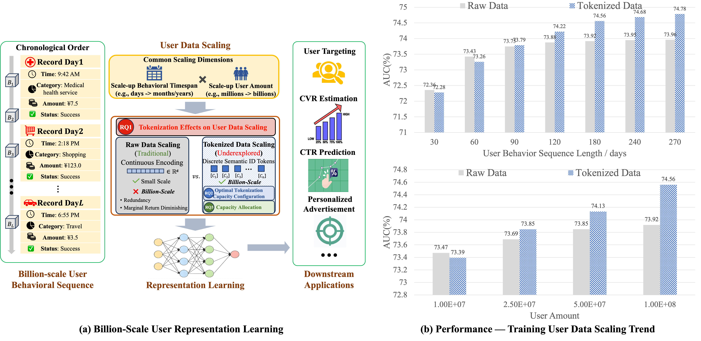

## Towards a Densing Law for User Representation Learning at Billion-Scale Capacity

[](https://arxiv.org/abs/2608.23392)
[](https://huggingface.co/papers/2608.23392)
[](https://www.antgroup.com)

This repository contains the implementation for the paper: **Towards a Densing Law for User Representation Learning at Billion-Scale Capacity**. 

User representation learning in real-world industrial scenarios is commonly scaled by increasing user amount, behavioral sequence length, and model size. However, existing. methods face two challenges: (i) *Bottleneck for raw data scaling at billion-scale capacity*, as performance exhibit diminishing performance gains with larger-scale raw text user behavioral input, which can be mitigated by tokenization. (ii) *Lack of quantitative analysis of how tokenization configurations should scale with data size*. In this report, we propose User. Behavioral Densing Law for characterizing the quantitative relationship between data scale and the minimum sufficient tokenization capacity. Firstly, we conduct a pilot study on raw & tokenized scaling comparison on billion-scale Alipay dataset, revealing the raw data scaling bottleneck and the sustained gains enabled by tokenization. To derive the scaling. pattern governing the minimum sufficient tokenization configuration at different data scales,  theoretical analysis and systematic experiments are employed to summarize the quantitative scaling pattern. We find an approximately linear relationship between the logarithms of. minimum sufficient tokenization capacity and input data size measured by tokens, and the scaling slope varies systematically with the tokenization method and data source, reflecting differences in representation-space redundancy and intra-source uniqueness. Guided by the proposed law, we further develop ALGN, an adaptive variable-length tokenization method that improves capacity allocation. Extensive experiments across diverse data sources, tokenization methods, and downstream tasks demonstrate the generalizability and reliability of the User Behavioral Densing Law, providing practical guidance for tokenization configuration selection in large-scale user representation learning. Moreover, ALGN outperforms existing baselines in both predictive performance and tokenization efficiency.



More details are provided in our [technical report](https://arxiv.org/abs/2608.23392).

---
## 📚 Citation
If you find our work useful for your research, please kindly cite our paper as follows:
```python
@misc{dou2026densinglawuserrepresentation,
      title={Towards a Densing Law for User Representation Learning at Billion-Scale Capacity}, 
      author={Bin Dou and Junru Zhang and Zhaoyi Yuan and Wuliang Huang and Letian Gong and Baokun Wang and Huan Li and Yu Cheng and Weiqiang Wang},
      year={2026},
      eprint={2608.23392},
      archivePrefix={arXiv},
      primaryClass={cs.IR},
      url={https://arxiv.org/abs/2608.23392}, 
}

@inproceedings{he2026foundv2,
  title={FOUNDv2: Learning Unified User Quantized Tokenizers for User Representation},
  author={He, Chuan and Chen, Yang and Dou, Bin and Huang, Wuliang and Wang, Baokun and Liu, Yongchao and Fu, Xing and Cheng, Yu and Hong, Chuntao and Wang, Weiqiang and others},
  booktitle={Proceedings of the 32nd ACM SIGKDD Conference on Knowledge Discovery and Data Mining V. 2},
  pages={7346--7357},
  year={2026}
}
```
