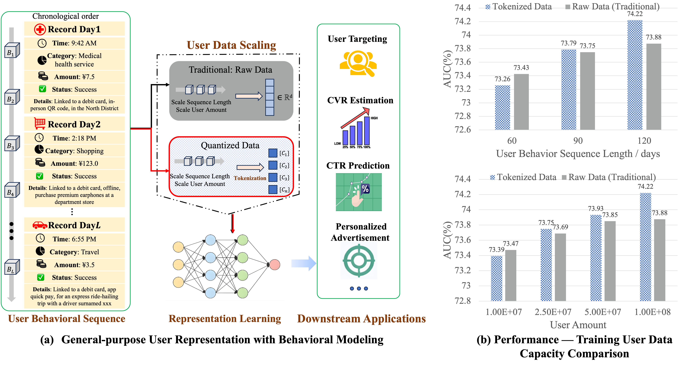

## Towards a Densing Law for User Representation Learning at Billion-Scale Capacity

This repository contains the implementation for the paper: Towards a Densing Law for User Representation Learning at Billion-Scale Capacity. 

We propose User Behavioral Densing Law for characterizing the quantitative relationship between data scale and the minimum sufficient tokenization capacity. Firstly, we conduct pilot study on raw & tokenized scaling comparison on billion-scale Alipay dataset, revealing the raw data scaling bottleneck and breakthrough via tokenization. To derive the scaling pattern governing the minimum sufficient tokenization configuration at different data scales, theoretical and experimental analyses are employed to summarize the quantitative scaling pattern. In addition, we propose a new tokenization method named ALGN inspired by the proposed Densing Law.

More detailed results and experimental settings are provided in our technical report.
